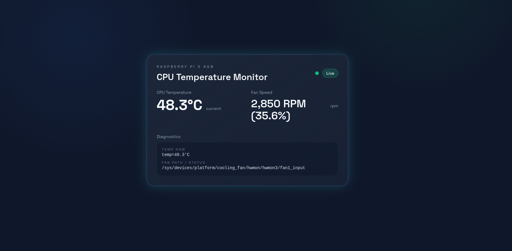

# Raspberry Pi CPU Temp & Fan Monitor



Minimal FastAPI + Tailwind web UI that shows live CPU temperature and Raspberry Pi 5 Active Cooler fan speed (RPM + % of 8000 max). The backend only reads when the browser polls `/api/stats`, so no commands or sysfs reads occur when nobody is connected.

## Requirements
- Raspberry Pi OS with `vcgencmd` available (usually `/usr/bin/vcgencmd`)
- Docker and Docker Compose

## Run with Docker Compose
```sh
docker compose build
docker compose up -d
```
Then open `http://<raspberry-pi-ip>:9000/` in your browser.

### Notes on mounts/devices
- `docker-compose.yml` bind-mounts:
  - `/usr/bin/vcgencmd:/usr/bin/vcgencmd:ro` for temperature.
  - `/sys:/sys:ro` so the app can find `/sys/devices/platform/cooling_fan/hwmon*/fan1_input` for fan RPM.
- Devices:
  - Raspberry Pi 5: `/dev/vcio`; older Pis: `/dev/vchiq`. Set the `devices:` entry to whichever exists.
- Adjust the vcgencmd path if `which vcgencmd` differs on your Pi.
- If permission issues arise, you can try uncommenting `privileged: true` (not recommended unless necessary).

## Project structure
- `main.py` — FastAPI app with `/` (HTML) and `/api/stats` (JSON: temp + fan rpm/%).
- `templates/index.html` — Tailwind CDN UI with 1s polling, starts/stops on focus/blur; shows temp, fan rpm, fan percent, diagnostics.
- `requirements.txt` — Python deps (fastapi, uvicorn, jinja2).
- `Dockerfile`, `docker-compose.yml` — Container build/run setup for Pi.

## Local (non-Docker) run
```sh
python -m venv .venv
source .venv/bin/activate    # on Windows: .venv\\Scripts\\activate
pip install -r requirements.txt
uvicorn main:app --host 0.0.0.0 --port 9000
```
Visit `http://localhost:9000/`.
